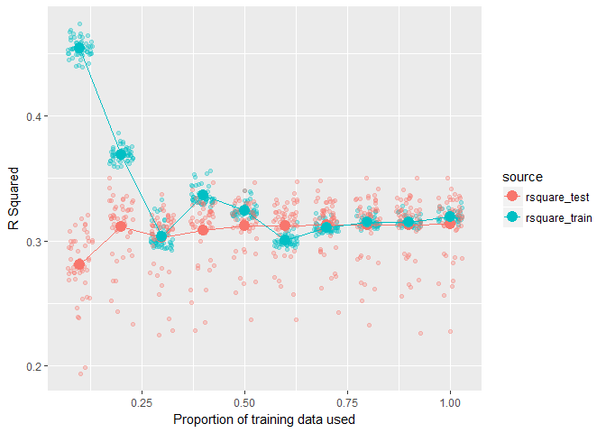

pipelearner
================

<!-- README.md is generated from README.Rmd. Please edit that file -->
pipelearner makes it easy to create machine learning pipelines in R.

Installation and background
---------------------------

pipelearner is currently available from github as a development package only. It can be installed by running:

``` r
# install.packages("devtools")
devtools::install_github("drsimonj/pipelearner")
```

pipelearner is built on top of [tidyverse](https://github.com/tidyverse/tidyverse) packages like [modelr](https://github.com/hadley/modelr). To harness the full power of pipelearner, it will help to possess some technical knowledge of tidyverse tools such as:

-   `%>%` the pipe operator from [magrittr]() package.
-   tibbles from [tibble]() package.
-   `map()` and other iteration functions from [purrr]() package.
-   `resample` objects from [modelr](https://github.com/hadley/modelr) package.

An excellent resource to get started with these is Hadley Wickham's book, [R for Data Science](http://r4ds.had.co.nz/).

The basics
----------

Like how ggplot2 elements are layered with `+`, pipelearner involves building a pipelearner object, which is a list, with functions that can be piped into eachother with `%>%`:

-   `pipelearner()` to setup the pipelearner object
-   `learn_cvpairs()` to customize the cross-validation pairs
-   `learn_curves()` to customize the learning curves using incremental proportions of training data
-   `learn_models()` to add new learning models.

Once the pipelearner object is setup, call `learn()` to fit everything and `summary()` to extract the results as a tibble.

Simple case
-----------

The following sets up a single regression model `lm` for predicting `Sepal.Length` with all other variables (`Sepal.Length ~ .`) in the `iris` data set.

``` r
library(pipelearner)

pl <- pipelearner(iris, lm, Sepal.Length ~ .)
```

Printing a pipelearner object exposes the list elements:

``` r
pl
#> $data
#> # A tibble: 150 × 5
#>    Sepal.Length Sepal.Width Petal.Length Petal.Width Species
#>           <dbl>       <dbl>        <dbl>       <dbl>  <fctr>
#> 1           5.1         3.5          1.4         0.2  setosa
#> 2           4.9         3.0          1.4         0.2  setosa
#> 3           4.7         3.2          1.3         0.2  setosa
#> 4           4.6         3.1          1.5         0.2  setosa
#> 5           5.0         3.6          1.4         0.2  setosa
#> 6           5.4         3.9          1.7         0.4  setosa
#> 7           4.6         3.4          1.4         0.3  setosa
#> 8           5.0         3.4          1.5         0.2  setosa
#> 9           4.4         2.9          1.4         0.2  setosa
#> 10          4.9         3.1          1.5         0.1  setosa
#> # ... with 140 more rows
#> 
#> $cv_pairs
#> # A tibble: 1 × 3
#>            train           test   .id
#>           <list>         <list> <chr>
#> 1 <S3: resample> <S3: resample>     1
#> 
#> $train_ps
#> [1] 1
#> 
#> $models
#> # A tibble: 1 × 5
#>         target model     params     .f   .id
#>          <chr> <chr>     <list> <list> <chr>
#> 1 Sepal.Length    lm <list [1]>  <fun>     1
#> 
#> $fits
#> NULL
#> 
#> attr(,"class")
#> [1] "pipelearner"
```

**Defaults** to note:

-   `data` is split into a single cross-validation pair of resample objects (under `cv_pairs`) referencing 80% of the data for training and 20% for testing.
-   Learning is done on the entire proportion of the training data (`train_ps == 1`).

When we've setup these elements as desired, use `learn()` to fit all models to every combination of training proportions (`train_ps`) and set of training data in the cross-validation pairs (`cv_pairs`). use `summary()` to obtain a tibble of the results.

``` r
pl %>% learn() %>% summary()
#> # A tibble: 1 × 10
#>   models.id cv_pairs.id train_p      fit       target model     params
#>       <chr>       <chr>   <dbl>   <list>        <chr> <chr>     <list>
#> 1         1           1       1 <S3: lm> Sepal.Length    lm <list [1]>
#> # ... with 3 more variables: train <list>, test <list>, .id <chr>
```

Quick notes:

-   `fit` contains our fitted model.
-   `train` contains a resample object referencing the data that model was fitted to.
-   `test` contains a resample object referencing test data that our model was *not* fitted to (for later use).

Cross-validation pairs
----------------------

Cross-validation pairs can be customized with `learn_cvpairs`. The following implements k-fold cross-validation, creating five folds:

``` r
pl %>%
  learn_cvpairs(k = 5) %>% 
  learn() %>% 
  summary()
#> # A tibble: 5 × 10
#>   models.id cv_pairs.id train_p      fit       target model     params
#>       <chr>       <chr>   <dbl>   <list>        <chr> <chr>     <list>
#> 1         1           1       1 <S3: lm> Sepal.Length    lm <list [1]>
#> 2         1           2       1 <S3: lm> Sepal.Length    lm <list [1]>
#> 3         1           3       1 <S3: lm> Sepal.Length    lm <list [1]>
#> 4         1           4       1 <S3: lm> Sepal.Length    lm <list [1]>
#> 5         1           5       1 <S3: lm> Sepal.Length    lm <list [1]>
#> # ... with 3 more variables: train <list>, test <list>, .id <chr>
```

Notice the five rows where the model has been fitted to training data for each fold, represented by `cv_pairs.id`.

Learning curves
---------------

Learning curves can be customized wth `learn_curves`. The following will fit the model to three proportions of the training data - .5, .75, and 1:

``` r
pl %>% 
  learn_curves(.5, .75, 1) %>% 
  learn() %>% 
  summary()
#> # A tibble: 3 × 10
#>   models.id cv_pairs.id train_p      fit       target model     params
#>       <chr>       <chr>   <dbl>   <list>        <chr> <chr>     <list>
#> 1         1           1    0.50 <S3: lm> Sepal.Length    lm <list [1]>
#> 2         1           1    0.75 <S3: lm> Sepal.Length    lm <list [1]>
#> 3         1           1    1.00 <S3: lm> Sepal.Length    lm <list [1]>
#> # ... with 3 more variables: train <list>, test <list>, .id <chr>
```

Notice the three rows where the model has been fitted to the three proportions of the training data, represented by `train_p`.

More models
-----------

We can add many models with `learn_models()`, which, unlike the previous functions, we can use many times. For example, the following adds a decision tree to be fitted:

``` r
pl %>% 
  learn_models(rpart::rpart, Sepal.Length ~ .) %>% 
  learn() %>% 
  summary()
#> # A tibble: 2 × 10
#>   models.id cv_pairs.id train_p         fit       target        model
#>       <chr>       <chr>   <dbl>      <list>        <chr>        <chr>
#> 1         1           1       1    <S3: lm> Sepal.Length           lm
#> 2         2           1       1 <S3: rpart> Sepal.Length rpart::rpart
#> # ... with 4 more variables: params <list>, train <list>, test <list>,
#> #   .id <chr>
```

Notice two rows where the regression and decision tree models have been fit to the training data, represented by `models.id`.

Two things to know about `learn_models()`:

-   When arguments beyond a data frame are supplied to `pipelearner()`, such as `lm` and the formula above, these are used by `learn_models()`. This makes calls like `pipelearner(d, l, f, ...)` the same as `pipelearner(d) %>% learn_models(l, f, ...)`. `learn_models()` is very flexible. It will take a pipelearner object followed by a vector of model functions, a vector of formulas, and vector of any additional hyperparameters. When vectors are provided, all combinations are expanded, making it easy to do things like compare many models with the same formulas, compare many different formulas, or do grid-search.

For example, the following compares linear regression and a decision tree over different formulas:

``` r
pipelearner(iris) %>%
  learn_models(c(lm, rpart::rpart),
               c(Sepal.Length ~ Sepal.Width,
                 Sepal.Length ~ Sepal.Width + Petal.Length,
                 Sepal.Length ~ Sepal.Width + Petal.Length + Species)) %>% 
  learn() %>% 
  summary()
#> # A tibble: 6 × 10
#>   models.id cv_pairs.id train_p         fit       target
#>       <chr>       <chr>   <dbl>      <list>        <chr>
#> 1         1           1       1    <S3: lm> Sepal.Length
#> 2         2           1       1 <S3: rpart> Sepal.Length
#> 3         3           1       1    <S3: lm> Sepal.Length
#> 4         4           1       1 <S3: rpart> Sepal.Length
#> 5         5           1       1    <S3: lm> Sepal.Length
#> 6         6           1       1 <S3: rpart> Sepal.Length
#> # ... with 5 more variables: model <chr>, params <list>, train <list>,
#> #   test <list>, .id <chr>
```

The following tests a regression model and grid-searches hyperparameters of a decision tree:

``` r
pipelearner(iris) %>%
  learn_models(lm, Sepal.Length ~ .) %>% 
  learn_models(rpart::rpart, Sepal.Length ~ .,
               minsplit = c(2, 20), cp = c(0.01, 0.1)) %>% 
  learn() %>% 
  summary()
#> # A tibble: 5 × 10
#>   models.id cv_pairs.id train_p         fit       target        model
#>       <chr>       <chr>   <dbl>      <list>        <chr>        <chr>
#> 1         1           1       1    <S3: lm> Sepal.Length           lm
#> 2         2           1       1 <S3: rpart> Sepal.Length rpart::rpart
#> 3         3           1       1 <S3: rpart> Sepal.Length rpart::rpart
#> 4         4           1       1 <S3: rpart> Sepal.Length rpart::rpart
#> 5         5           1       1 <S3: rpart> Sepal.Length rpart::rpart
#> # ... with 4 more variables: params <list>, train <list>, test <list>,
#> #   .id <chr>
```

Brining it all together
-----------------------

All of the functions can be combined. For example, the following will:

-   Create 50 cross-validation pairs (holding out random 20% of data in each)
-   To each be fitted in proportions of .5 to 1 in increments of .1.
-   With a regression modelling all interactions, and a decision tree modelling all features.

``` r
iris %>% 
  pipelearner() %>% 
  learn_cvpairs(n = 50) %>% 
  learn_curves(seq(.5, 1, by = .1)) %>% 
  learn_models(lm, Sepal.Width ~ .*.) %>% 
  learn_models(rpart::rpart, Sepal.Width ~ .) %>% 
  learn() %>% 
  summary()
#> # A tibble: 600 × 10
#>    models.id cv_pairs.id train_p      fit      target model     params
#>        <chr>       <chr>   <dbl>   <list>       <chr> <chr>     <list>
#> 1          1          01     0.5 <S3: lm> Sepal.Width    lm <list [1]>
#> 2          1          01     0.6 <S3: lm> Sepal.Width    lm <list [1]>
#> 3          1          01     0.7 <S3: lm> Sepal.Width    lm <list [1]>
#> 4          1          01     0.8 <S3: lm> Sepal.Width    lm <list [1]>
#> 5          1          01     0.9 <S3: lm> Sepal.Width    lm <list [1]>
#> 6          1          01     1.0 <S3: lm> Sepal.Width    lm <list [1]>
#> 7          1          02     0.5 <S3: lm> Sepal.Width    lm <list [1]>
#> 8          1          02     0.6 <S3: lm> Sepal.Width    lm <list [1]>
#> 9          1          02     0.7 <S3: lm> Sepal.Width    lm <list [1]>
#> 10         1          02     0.8 <S3: lm> Sepal.Width    lm <list [1]>
#> # ... with 590 more rows, and 3 more variables: train <list>, test <list>,
#> #   .id <chr>
```

Extracting information from fits
--------------------------------

As you can see, pipelearner makes it easy to fit many models. The next step is to extract performance metrics from the tibble of results. This is where prior familiarity working with tidyverse tools becomes useful, if not essential.

At present, pipelearner doesn't provide functions to extract any further information. This is because the information to be extracted can vary considerably between the models fitted to the data.

The following will demonstrate an example of visualising learning curves by extracting performance information from regression models.

We'll use the following function `r_square()`, modelled after `modelr::rsquare`, but adjusted to handle new data sets (I've submitted an issue to incorporate into `modelr`).

``` r
# R-Squared scoring (because modelr rsquare doen't work right now)
response_var <- function(model) {
  formula(model)[[2L]]
}
response <- function(model, data) {
  eval(response_var(model), as.data.frame(data))
}
r_square <- function(model, data) {
  actual    <- response(model, data)
  residuals <- predict(model, data) - actual
  1 - (var(residuals, na.rm = TRUE) / var(actual, na.rm = TRUE))
}
```

Using the `weather` data from the `nycflights13` package, fit a single regression model to 50 cross-validation pairs, holding out 15% of the data for testing in each case, in iterative training proportions:

``` r
library(nycflights13)

results <- weather %>% 
  pipelearner() %>% 
  learn_cvpairs(n = 50, test = .15) %>% 
  learn_curves(seq(.1, 1, by = .1)) %>% 
  learn_models(lm, visib ~ humid + precip + wind_dir) %>% 
  learn() %>% 
  summary()
results
#> # A tibble: 500 × 10
#>    models.id cv_pairs.id train_p      fit target model     params
#>        <chr>       <chr>   <dbl>   <list>  <chr> <chr>     <list>
#> 1          1          01     0.1 <S3: lm>  visib    lm <list [1]>
#> 2          1          01     0.2 <S3: lm>  visib    lm <list [1]>
#> 3          1          01     0.3 <S3: lm>  visib    lm <list [1]>
#> 4          1          01     0.4 <S3: lm>  visib    lm <list [1]>
#> 5          1          01     0.5 <S3: lm>  visib    lm <list [1]>
#> 6          1          01     0.6 <S3: lm>  visib    lm <list [1]>
#> 7          1          01     0.7 <S3: lm>  visib    lm <list [1]>
#> 8          1          01     0.8 <S3: lm>  visib    lm <list [1]>
#> 9          1          01     0.9 <S3: lm>  visib    lm <list [1]>
#> 10         1          01     1.0 <S3: lm>  visib    lm <list [1]>
#> # ... with 490 more rows, and 3 more variables: train <list>, test <list>,
#> #   .id <chr>
```

We'll add new columns (with `dplyr::mutate`) containing the rsquared values for each set of training and test data by using `purrr` functions.

``` r
library(purrr)
library(dplyr)

results <- results %>% 
  mutate(
    rsquare_train = map2_dbl(fit, train, r_square),
    rsquare_test  = map2_dbl(fit, test,  r_square)
  )

results %>% select(cv_pairs.id, train_p, contains("rsquare"))
#> # A tibble: 500 × 4
#>    cv_pairs.id train_p rsquare_train rsquare_test
#>          <chr>   <dbl>         <dbl>        <dbl>
#> 1           01     0.1     0.4555859    0.2715561
#> 2           01     0.2     0.3724131    0.3143262
#> 3           01     0.3     0.3011811    0.3095932
#> 4           01     0.4     0.3372752    0.3104970
#> 5           01     0.5     0.3260482    0.3114620
#> 6           01     0.6     0.3025314    0.3139452
#> 7           01     0.7     0.3118713    0.3129080
#> 8           01     0.8     0.3158607    0.3140055
#> 9           01     0.9     0.3157010    0.3152844
#> 10          01     1.0     0.3192894    0.3151059
#> # ... with 490 more rows
```

We can visualize these learning curves as follows:

``` r
library(tidyr)
library(ggplot2)

results %>% 
  select(train_p, contains("rsquare")) %>% 
  gather(source, rsquare, contains("rsquare")) %>% 
  ggplot(aes(train_p, rsquare, color = source)) +
   geom_jitter(width = .03, alpha = .3) +
   stat_summary(geom = "line", fun.y = mean) +
   stat_summary(geom = "point", fun.y = mean, size = 4) +
   labs(x = "Proportion of training data used",
        y = "R Squared")
```


