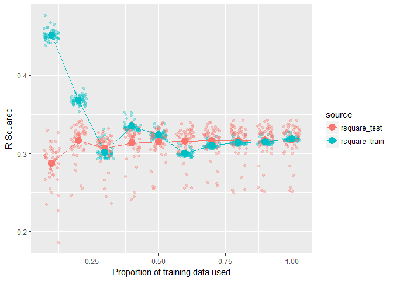
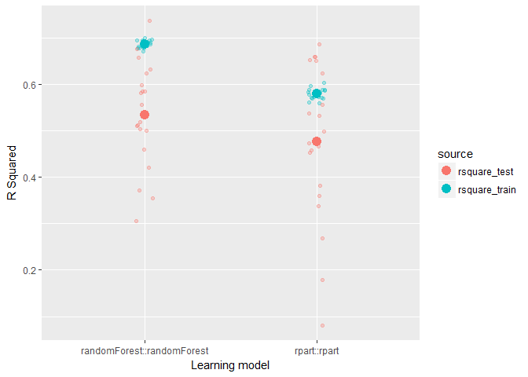

pipelearner
================

<!-- README.md is generated from README.Rmd. Please edit that file -->
pipelearner makes it easy to create machine learning pipelines in R.

Installation and background
---------------------------

pipelearner is currently available from github as a development package only. It can be installed by running:

``` r
# install.packages("devtools")
devtools::install_github("drsimonj/pipelearner")
```

pipelearner is built on top of [tidyverse](https://github.com/tidyverse/tidyverse) packages like [modelr](https://github.com/hadley/modelr). To harness the full power of pipelearner, it will help to possess some technical knowledge of tidyverse tools such as:

-   `%>%` the pipe operator from [magrittr](https://github.com/tidyverse/magrittr) package.
-   tibbles from [tibble](https://github.com/tidyverse/tibble) package.
-   `map()` and other iteration functions from [purrr](https://github.com/hadley/purrr) package.
-   `resample` objects from [modelr](https://github.com/hadley/modelr) package.

An excellent resource to get started with these is [R for Data Science](http://r4ds.had.co.nz/), by Garrett Grolemund and Hadley Wickham.

API
---

Similar to the way ggplot2 elements are layered with `+`, you initialize and customize a pipelearner object, which is a list, with functions that can be piped into eachother with `%>%`. Rather than plotting, however, a pipelearner then learns.

**Initialize** a pipelearner object with:

-   `pipelearner()`

**Customize** a pipelearner with:

-   `learn_cvpairs()` to customize the cross-validation pairs.
-   `learn_curves()` to customize the learning curves using incremental proportions of training data.
-   `learn_models()` to add new learning models.

**Learn** (fit) everything and obtain a tibble of results with:

-   `learn()`

### Initialization

The following initializes a pipelearner object that will use the `iris` data set and linear regression (`lm`) to learn how to predict `Sepal.Length` with all other available variables (`Sepal.Length ~ .`).

``` r
library(pipelearner)

pl <- pipelearner(iris, lm, Sepal.Length ~ .)
```

Print a pipelearner object to expose the list elements.

``` r
pl
#> $data
#> # A tibble: 150 × 5
#>    Sepal.Length Sepal.Width Petal.Length Petal.Width Species
#>           <dbl>       <dbl>        <dbl>       <dbl>  <fctr>
#> 1           5.1         3.5          1.4         0.2  setosa
#> 2           4.9         3.0          1.4         0.2  setosa
#> 3           4.7         3.2          1.3         0.2  setosa
#> 4           4.6         3.1          1.5         0.2  setosa
#> 5           5.0         3.6          1.4         0.2  setosa
#> 6           5.4         3.9          1.7         0.4  setosa
#> 7           4.6         3.4          1.4         0.3  setosa
#> 8           5.0         3.4          1.5         0.2  setosa
#> 9           4.4         2.9          1.4         0.2  setosa
#> 10          4.9         3.1          1.5         0.1  setosa
#> # ... with 140 more rows
#> 
#> $cv_pairs
#> # A tibble: 1 × 3
#>            train           test   .id
#>           <list>         <list> <chr>
#> 1 <S3: resample> <S3: resample>     1
#> 
#> $train_ps
#> [1] 1
#> 
#> $models
#> # A tibble: 1 × 5
#>         target model     params     .f   .id
#>          <chr> <chr>     <list> <list> <chr>
#> 1 Sepal.Length    lm <list [1]>  <fun>     1
#> 
#> attr(,"class")
#> [1] "pipelearner"
```

##### Defaults to note

-   `data` is split into a single cross-validation pair of resample objects (under `cv_pairs`) referencing 80% of the data for training and 20% for testing.
-   Learning is done on the entire proportion of the training data (`train_ps == 1`).

### Learning

Once a pipelearner is setup, use `learn()` to fit all models to every combination of training proportions (`train_ps`) and set of training data in the cross-validation pairs (`cv_pairs`), and return a tibble of the results.

``` r
pl %>% learn()
#> # A tibble: 1 × 9
#>   models.id cv_pairs.id train_p      fit       target model     params
#>       <chr>       <chr>   <dbl>   <list>        <chr> <chr>     <list>
#> 1         1           1       1 <S3: lm> Sepal.Length    lm <list [1]>
#> # ... with 2 more variables: train <list>, test <list>
```

##### Quick notes

-   `fit` contains the fitted models.
-   `params` contains all model parameters including the formula.
-   `train` contains a resample object referencing the data that each model was fitted to.
-   `test` contains a resample object referencing test data that models were *not* fitted to (for later use).

### Cross-validation pairs

Cross-validation pairs can be customized with `learn_cvpairs()`. The following implements cross-validation with 5 random samples of 10 elements in each training set.

``` r
pl %>%
  learn_cvpairs(resamplr::holdout_n, size = 10, K = 5) %>% 
  learn()
#> # A tibble: 5 × 9
#>   models.id cv_pairs.id train_p      fit       target model     params
#>       <chr>       <int>   <dbl>   <list>        <chr> <chr>     <list>
#> 1         1           1       1 <S3: lm> Sepal.Length    lm <list [1]>
#> 2         1           2       1 <S3: lm> Sepal.Length    lm <list [1]>
#> 3         1           3       1 <S3: lm> Sepal.Length    lm <list [1]>
#> 4         1           4       1 <S3: lm> Sepal.Length    lm <list [1]>
#> 5         1           5       1 <S3: lm> Sepal.Length    lm <list [1]>
#> # ... with 2 more variables: train <list>, test <list>
```

Notice the five rows where the model has been fitted to training data for each fold, represented by `cv_pairs.id`. The precise training data sets are also stored under `train`.

### Learning curves

Learning curves can be customized wth `learn_curves()`. The following will fit the model to three proportions of the training data (.5, .75, and 1):

``` r
pl %>% 
  learn_curves(.5, .75, 1) %>% 
  learn()
#> # A tibble: 3 × 9
#>   models.id cv_pairs.id train_p      fit       target model     params
#>       <chr>       <chr>   <dbl>   <list>        <chr> <chr>     <list>
#> 1         1           1    0.50 <S3: lm> Sepal.Length    lm <list [1]>
#> 2         1           1    0.75 <S3: lm> Sepal.Length    lm <list [1]>
#> 3         1           1    1.00 <S3: lm> Sepal.Length    lm <list [1]>
#> # ... with 2 more variables: train <list>, test <list>
```

Notice the three rows where the model has been fitted to the three proportions of the training data, represented by `train_p`. Again, `train` contains references to the precise data used in each case.

### More models

Add more models with `learn_models()`. For example, the following adds a decision tree to be fitted:

``` r
pl %>% 
  learn_models(rpart::rpart, Sepal.Length ~ .) %>% 
  learn()
#> # A tibble: 2 × 9
#>   models.id cv_pairs.id train_p         fit       target model     params
#>       <chr>       <chr>   <dbl>      <list>        <chr> <chr>     <list>
#> 1         1           1       1    <S3: lm> Sepal.Length    lm <list [1]>
#> 2         2           1       1 <S3: rpart> Sepal.Length rpart <list [1]>
#> # ... with 2 more variables: train <list>, test <list>
```

Notice two rows where the regression and decision tree models have been fit to the training data, represented by `models.id`. The different model calls also appear under `model`.

Things to know about `learn_models()`:

-   Unlike the other `learn_*()` functions, it can be called multiple times within the pipeline.
-   It is called implicitly by `pipelearner()` when arguments beyond a data frame are supplied. For example, `pipelearner(d, l, f, ...)` is equivalent to `pipelearner(d) %>% learn_models(l, f, ...)`.
-   Its arguments can all be vectors, which will be expanded to all combinations. This makes it easy to do things like compare many models with the same formulas, compare many different formulas, or do grid-search.

For example, the following fits two models with three formulas:

``` r
pipelearner(iris) %>%
  learn_models(c(lm, rpart::rpart),
               c(Sepal.Length ~ Sepal.Width,
                 Sepal.Length ~ Sepal.Width + Petal.Length,
                 Sepal.Length ~ Sepal.Width + Petal.Length + Species)) %>% 
  learn()
#> # A tibble: 6 × 9
#>   models.id cv_pairs.id train_p         fit       target        model
#>       <chr>       <chr>   <dbl>      <list>        <chr>        <chr>
#> 1         1           1       1    <S3: lm> Sepal.Length           lm
#> 2         2           1       1 <S3: rpart> Sepal.Length rpart::rpart
#> 3         3           1       1    <S3: lm> Sepal.Length           lm
#> 4         4           1       1 <S3: rpart> Sepal.Length rpart::rpart
#> 5         5           1       1    <S3: lm> Sepal.Length           lm
#> 6         6           1       1 <S3: rpart> Sepal.Length rpart::rpart
#> # ... with 3 more variables: params <list>, train <list>, test <list>
```

The following fits a regression model and grid-searches hyperparameters of a decision tree:

``` r
pipelearner(iris) %>%
  learn_models(lm, Sepal.Length ~ .) %>% 
  learn_models(rpart::rpart, Sepal.Length ~ .,
               minsplit = c(2, 20), cp = c(0.01, 0.1)) %>% 
  learn()
#> # A tibble: 5 × 9
#>   models.id cv_pairs.id train_p         fit       target model     params
#>       <chr>       <chr>   <dbl>      <list>        <chr> <chr>     <list>
#> 1         1           1       1    <S3: lm> Sepal.Length    lm <list [1]>
#> 2         2           1       1 <S3: rpart> Sepal.Length rpart <list [3]>
#> 3         3           1       1 <S3: rpart> Sepal.Length rpart <list [3]>
#> 4         4           1       1 <S3: rpart> Sepal.Length rpart <list [3]>
#> 5         5           1       1 <S3: rpart> Sepal.Length rpart <list [3]>
#> # ... with 2 more variables: train <list>, test <list>
```

Remember that these additional parameters (including different formulas) are contained under `params`.

Bringing it all together
------------------------

After initialization, pipelearner functions can be combined in a single pipeline. For example, the following will:

-   Initialize a blank pipelearner object with the `iris` data set.
-   Create 50 cross-validation pairs (holding out random 20% of data by default in each)...
-   to each be fitted in sample size proportions of .5 to 1 in increments of .1.
-   With a regression modelling all interactions...
-   and a decision tree modelling all features.
-   Fit all models and return the results.

``` r
iris %>% 
  pipelearner() %>%
  learn_cvpairs(modelr::crossv_mc, n = 50) %>%
  learn_curves(seq(.5, 1, by = .1)) %>% 
  learn_models(lm, Sepal.Width ~ .*.) %>% 
  learn_models(rpart::rpart, Sepal.Width ~ .) %>% 
  learn()
#> # A tibble: 600 × 9
#>    models.id cv_pairs.id train_p      fit      target model     params
#>        <chr>       <chr>   <dbl>   <list>       <chr> <chr>     <list>
#> 1          1          01     0.5 <S3: lm> Sepal.Width    lm <list [1]>
#> 2          1          01     0.6 <S3: lm> Sepal.Width    lm <list [1]>
#> 3          1          01     0.7 <S3: lm> Sepal.Width    lm <list [1]>
#> 4          1          01     0.8 <S3: lm> Sepal.Width    lm <list [1]>
#> 5          1          01     0.9 <S3: lm> Sepal.Width    lm <list [1]>
#> 6          1          01     1.0 <S3: lm> Sepal.Width    lm <list [1]>
#> 7          1          02     0.5 <S3: lm> Sepal.Width    lm <list [1]>
#> 8          1          02     0.6 <S3: lm> Sepal.Width    lm <list [1]>
#> 9          1          02     0.7 <S3: lm> Sepal.Width    lm <list [1]>
#> 10         1          02     0.8 <S3: lm> Sepal.Width    lm <list [1]>
#> # ... with 590 more rows, and 2 more variables: train <list>, test <list>
```

Beyond learning
---------------

As you can see, pipelearner makes it easy to fit many models. The next step is to extract performance metrics from the tibble of results. This is where prior familiarity working with tidyverse tools becomes useful if not essential.

At present, pipelearner doesn't provide functions to extract any further information. This is because the information to be extracted can vary considerably between the models fitted to the data.

The following will demonstrate an example of visualising learning curves by extracting performance information from regression models.

`r_square()` is setup to extract an R-squared value. It is based on `modelr::rsquare`, but adjusted to handle new data sets (I've submitted [an issue](https://github.com/hadley/modelr/issues/37) to incorporate into `modelr`).

``` r
# R-Squared scoring (because modelr rsquare doen't work right now)
response_var <- function(model) {
  formula(model)[[2L]]
}
response <- function(model, data) {
  eval(response_var(model), as.data.frame(data))
}
r_square <- function(model, data) {
  actual    <- response(model, data)
  residuals <- predict(model, data) - actual
  1 - (var(residuals, na.rm = TRUE) / var(actual, na.rm = TRUE))
}
```

Using a subset of the `weather` data from the `nycflights13` package, fit a single regression model to 50 cross-validation pairs, holding out 15% of the data for testing in each case, in iterative training proportions. Note heavy use of tidyverse functions.

``` r
library(tidyverse)

# Create the data set
library(nycflights13)
d <- weather %>%
  select(visib, humid, precip, wind_dir) %>% 
  drop_na() %>%
  sample_n(2000)

results <- d %>% 
  pipelearner() %>% 
  learn_cvpairs(modelr::crossv_mc, n = 50, test = .15) %>% 
  learn_curves(seq(.1, 1, by = .1)) %>% 
  learn_models(lm, visib ~ .) %>% 
  learn()
results
#> # A tibble: 500 × 9
#>    models.id cv_pairs.id train_p      fit target model     params
#>        <chr>       <chr>   <dbl>   <list>  <chr> <chr>     <list>
#> 1          1          01     0.1 <S3: lm>  visib    lm <list [1]>
#> 2          1          01     0.2 <S3: lm>  visib    lm <list [1]>
#> 3          1          01     0.3 <S3: lm>  visib    lm <list [1]>
#> 4          1          01     0.4 <S3: lm>  visib    lm <list [1]>
#> 5          1          01     0.5 <S3: lm>  visib    lm <list [1]>
#> 6          1          01     0.6 <S3: lm>  visib    lm <list [1]>
#> 7          1          01     0.7 <S3: lm>  visib    lm <list [1]>
#> 8          1          01     0.8 <S3: lm>  visib    lm <list [1]>
#> 9          1          01     0.9 <S3: lm>  visib    lm <list [1]>
#> 10         1          01     1.0 <S3: lm>  visib    lm <list [1]>
#> # ... with 490 more rows, and 2 more variables: train <list>, test <list>
```

New columns are added with `dplyr::mutate` containing the rsquared values for each set of training and test data by using `purrr` functions.

``` r
results <- results %>% 
  mutate(
    rsquare_train = map2_dbl(fit, train, r_square),
    rsquare_test  = map2_dbl(fit, test,  r_square)
  )

results %>% select(cv_pairs.id, train_p, contains("rsquare"))
#> # A tibble: 500 × 4
#>    cv_pairs.id train_p rsquare_train rsquare_test
#>          <chr>   <dbl>         <dbl>        <dbl>
#> 1           01     0.1     0.5294285    0.3673313
#> 2           01     0.2     0.4256662    0.3280880
#> 3           01     0.3     0.4188237    0.3453015
#> 4           01     0.4     0.4045662    0.3447929
#> 5           01     0.5     0.3805937    0.3497000
#> 6           01     0.6     0.3609124    0.3502331
#> 7           01     0.7     0.3609650    0.3466058
#> 8           01     0.8     0.3603936    0.3458909
#> 9           01     0.9     0.3686788    0.3500961
#> 10          01     1.0     0.3547963    0.3496594
#> # ... with 490 more rows
```

We can visualize these learning curves as follows:

``` r
results %>% 
  select(train_p, contains("rsquare")) %>% 
  gather(source, rsquare, contains("rsquare")) %>% 
  ggplot(aes(train_p, rsquare, color = source)) +
   geom_jitter(width = .03, alpha = .3) +
   stat_summary(geom = "line", fun.y = mean) +
   stat_summary(geom = "point", fun.y = mean, size = 4) +
   labs(x = "Proportion of training data used",
        y = "R Squared")
```



The example below fits a decision tree and random forest to 20 folds of a subset of the data.

``` r
results <-  d %>% 
  pipelearner() %>% 
  learn_cvpairs(modelr::crossv_kfold, k = 20) %>% 
  learn_models(c(rpart::rpart, randomForest::randomForest), 
               visib ~ .) %>% 
  learn()
results
#> # A tibble: 40 × 9
#>    models.id cv_pairs.id train_p         fit target        model
#>        <chr>       <chr>   <dbl>      <list>  <chr>        <chr>
#> 1          1          01       1 <S3: rpart>  visib rpart::rpart
#> 2          1          02       1 <S3: rpart>  visib rpart::rpart
#> 3          1          03       1 <S3: rpart>  visib rpart::rpart
#> 4          1          04       1 <S3: rpart>  visib rpart::rpart
#> 5          1          05       1 <S3: rpart>  visib rpart::rpart
#> 6          1          06       1 <S3: rpart>  visib rpart::rpart
#> 7          1          07       1 <S3: rpart>  visib rpart::rpart
#> 8          1          08       1 <S3: rpart>  visib rpart::rpart
#> 9          1          09       1 <S3: rpart>  visib rpart::rpart
#> 10         1          10       1 <S3: rpart>  visib rpart::rpart
#> # ... with 30 more rows, and 3 more variables: params <list>,
#> #   train <list>, test <list>
```

Then compute R-Square statistics and visualize the results:

``` r
results %>% 
  mutate(rsquare_train = map2_dbl(fit, train, r_square),
         rsquare_test  = map2_dbl(fit, test,  r_square)) %>% 
  select(model, contains("rsquare")) %>% 
  gather(source, rsquare, contains("rsquare")) %>%
  ggplot(aes(model, rsquare, color = source)) +
   geom_jitter(width = .05, alpha = .3) +
   stat_summary(geom = "point", fun.y = mean, size = 4) +
   labs(x = "Learning model",
        y = "R Squared")
```


